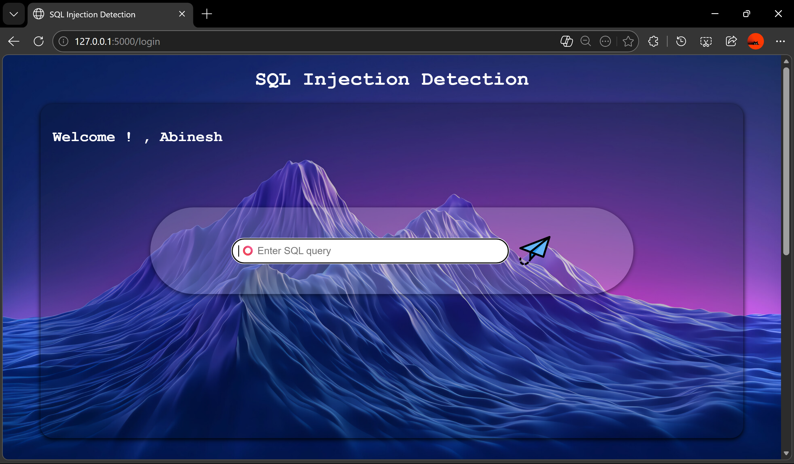
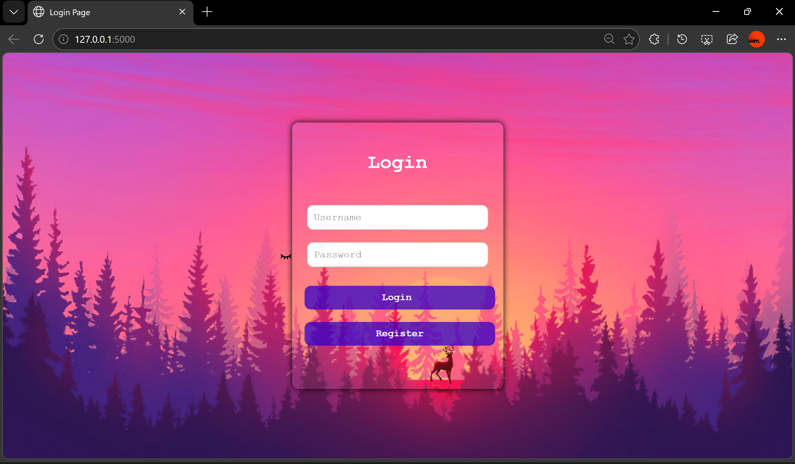
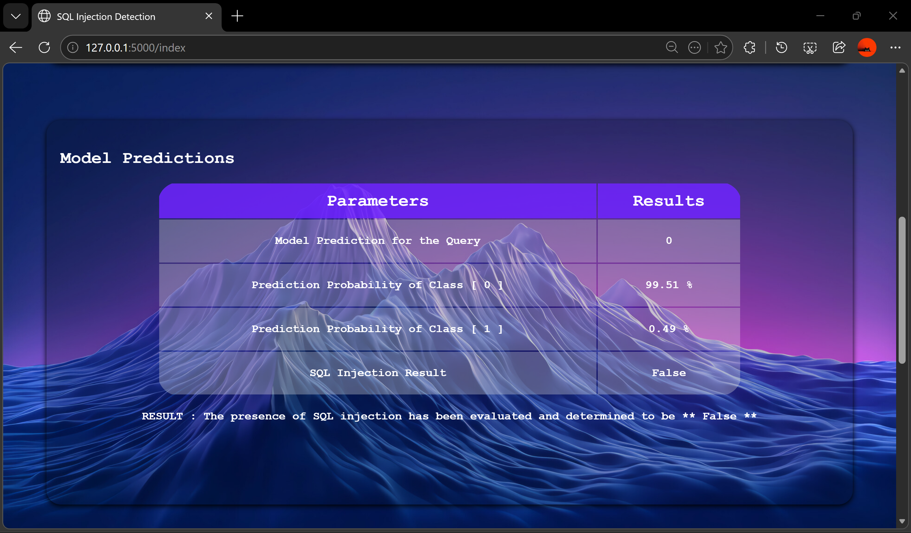
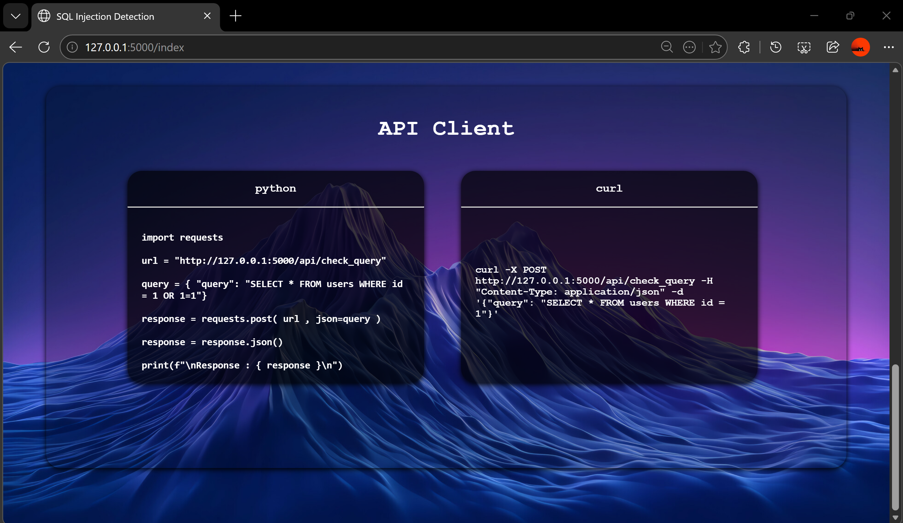

---

# SQL Injection Detection System

A **Machine Learning based SQL Injection Detection System** built using **Python, Flask, and Scikit-learn** that detects whether a given SQL query contains a **SQL Injection attack**.

<p align="center">
  
</p>

The project provides:

* A **web interface** to test SQL queries
* A **REST API** for programmatic access
* A **machine learning model** for classification
* A **vectorized NLP-based detection pipeline**

This system helps developers and security researchers identify **malicious SQL queries before execution**, improving application security.

---

# Project Motivation

SQL Injection is one of the most common and dangerous vulnerabilities in web applications. Attackers exploit poorly sanitized inputs to manipulate SQL queries and gain unauthorized access to databases.

This project was developed to:

* Demonstrate **AI-based cybersecurity detection**
* Build a **real-time SQL injection detection system**
* Provide both **Web UI and API access**
* Showcase **machine learning integration with Flask**

---

# Key Features

* Machine Learning based SQL Injection detection
* Flask-based Web Application
* REST API for external applications
* User login and registration system
* Query classification with probability scores
* Real-time prediction
* Visual result display
* Pre-trained ML model
* NLP vectorization pipeline

---

# Technologies Used

| Technology        | Purpose                   |
| ----------------- | ------------------------- |
| Python            | Core programming language |
| Flask             | Web framework             |
| Scikit-learn      | Machine learning model    |
| Pickle            | Model serialization       |
| HTML              | Frontend pages            |
| CSS               | UI styling                |
| REST API          | External access           |
| NLP Vectorization | Feature extraction        |

---

# System Architecture

```
User Input (SQL Query)
        │
        ▼
Flask Web Interface / REST API
        │
        ▼
Vectorizer (vectorizer.pkl)
        │
        ▼
Machine Learning Model (my_model.pkl)
        │
        ▼
Prediction Result
        │
        ▼
Safe Query / SQL Injection Detected
```

---

# Project Directory Structure

```
SQL-Injection-Detection
│
├── api_client.py
├── app.py
├── MODEL.py
├── my_model.pkl
├── vectorizer.pkl
├── users.py
├── users.txt
├── currentuser.txt
├── requirements.txt
├── wsgi.py
│
├── static
│   ├── css
│   │   ├── index.css
│   │   ├── login.css
│   │   └── register.css
│   │
│   └── images
│
├── templates
│   ├── index.html
│   ├── login.html
│   └── register.html
│
├── Examples
│   ├── api.png
│   ├── home.png
│   ├── login.png
│   └── result.png
```

---

# File Description

| File               | Description                                  |
| ------------------ | -------------------------------------------- |
| `app.py`           | Main Flask application                       |
| `MODEL.py`         | Machine learning model wrapper               |
| `my_model.pkl`     | Trained ML classification model              |
| `vectorizer.pkl`   | NLP vectorizer used for query transformation |
| `api_client.py`    | Client script to access REST API             |
| `users.py`         | User management system                       |
| `users.txt`        | Stores registered users                      |
| `currentuser.txt`  | Tracks active user                           |
| `requirements.txt` | Python dependencies                          |
| `wsgi.py`          | Production server entry point                |

---

# Machine Learning Model

The ML model classifies SQL queries into two classes:

| Class | Meaning              |
| ----- | -------------------- |
| 0     | Normal Query         |
| 1     | SQL Injection Attack |

The pipeline:

```
SQL Query
   ↓
Vectorization (TF-IDF / NLP)
   ↓
Machine Learning Model
   ↓
Prediction + Probability
```

---

# Prediction Logic

The prediction process works as follows:

```python
print("\nPrediction Result")

model_instance = Model()

sample_input = [sql_query]

prediction = model_instance.predict(sample_input)
prediction_proba = model_instance.predict_proba(sample_input)

print(f"Model Prediction for the Query : {prediction[0]}")
print(f"Prediction Probability of Class [0] : {prediction_proba[0][0] * 100}%")
print(f"Prediction Probability of Class [1] : {prediction_proba[0][1] * 100}%")
```

---

# SQL Injection Detection Logic

```python
if prediction[0] == 1:
    print("SQL Injection Detected")
    sqli = "True"
else:
    print("Safe Query")
    sqli = "False"
```

Where:

| Value | Meaning       |
| ----- | ------------- |
| 0     | Safe Query    |
| 1     | SQL Injection |

---

# Web Application

The Flask web interface allows users to:

* Register
* Login
* Submit SQL queries
* View prediction results

---

# Example Screenshots

## Home Page

This is the **main interface** of the application where users can submit SQL queries for analysis.




Users can:

* Enter SQL queries
* Submit for analysis
* View prediction results

The page acts as the **central interface of the detection system**.

---

## Login Page

This page allows registered users to authenticate before accessing the SQL detection tool.



Features:

* Username and password authentication
* Secure login
* Session tracking
* User validation using `users.txt`

---

## Result Page

This page displays the **prediction results of the SQL query**.



The page shows:

* Input SQL query
* Model prediction
* Probability of safe query
* Probability of SQL injection
* Final security evaluation

Example output:

```
Prediction Result

Model Prediction for the Query : 1
Probability Safe Query : 12.45%
Probability SQL Injection : 87.55%

SQL Injection Result

The presence of SQL injection has been evaluated and determined to be True
```

---

## API Example

The API allows external applications to send SQL queries and receive predictions.



This enables integration with:

* Web applications
* Security testing tools
* Automated vulnerability scanners
* DevSecOps pipelines

---

# REST API Usage

### Endpoint

```
POST /api/check_query
```

### Example Request

```json
{
 "query": "SELECT * FROM users WHERE username='admin' OR '1'='1'"
}
```

### Example Response

```json
{
 "prediction": 1,
 "safe_probability": 12.45,
 "injection_probability": 87.55,
 "sql_injection": true
}
```

---

# API Client

The `api_client.py` file demonstrates how to interact with the REST API.

Example:

```python
import requests

url = "http://localhost:5000/api/check_query"

query = {
    "query": "SELECT * FROM users WHERE id = 1 OR 1=1"
}

response = requests.post(url, json=query)

print(response.json())
```

---

# Installation Guide

### Clone Repository

```bash
git clone https://github.com/Abineshabee/SQL-Injection-Detection.git
cd SQL-Injection-Detection
```

---

### Install Dependencies

```bash
pip install -r requirements.txt
```

---

### Run the Application

```bash
python app.py
```

Server will start at:

```
http://127.0.0.1:5000
```

---

# Example SQL Queries

### Normal Query

```
SELECT * FROM users WHERE id = 10
```

Prediction:

```
Safe Query
```

---

### SQL Injection Query

```
SELECT * FROM users WHERE username='admin' OR '1'='1'
```

Prediction:

```
SQL Injection Detected
```

---

# Security Applications

This project can be used in:

* Web Application Firewalls
* Database security monitoring
* Automated penetration testing
* Secure web development
* Cybersecurity research

---

# Future Improvements

* Deep learning based detection
* Larger SQL injection dataset
* Real-time API gateway security
* Browser extension for detection
* Cloud deployment
* Advanced NLP feature engineering

---

# Author

**Abinesh N**

GitHub
[https://github.com/Abineshabee](https://github.com/Abineshabee)

---
